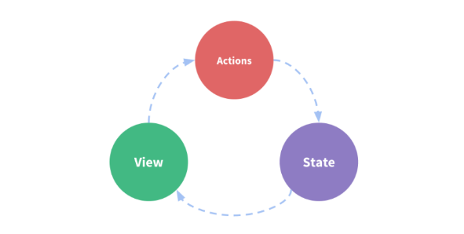
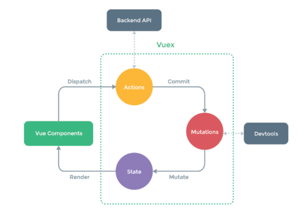

# Vuex - state management pattern library

* Vuex is a state management pattern + library for Vue.js applications. It serves as a centralized store for all the components in an application, with rules ensuring that the state can only be mutated in a predictable fashion.

## The problem

* Normal Vue apps are a __one-way data flow__:
  * The state, the source of truth that drives our app;
  * The view, a declarative mapping of the state;
  * The actions, the possible ways the state could change in reaction to user inputs from the view.
  * 
* Without vuex you have 
  * events to comunicate state up the hierarchy
  * props to communicate state down the hierarchy
* The simplicity quickly breaks down when we have multiple components that share a common state:
  * Multiple views may depend on the same piece of state.
    * passing props can be tedious for deeply nested components, and simply doesn't work for sibling components
  * Actions from different views may need to mutate the same piece of state (such as in memory shared parallel processes).
    * we often find ourselves resorting to solutions such as reaching for direct parent/child instance references or trying to mutate and synchronize multiple copies of the state via events

## The solution

* Vuex __extracts the shared state out of the components, and manage it in a global singleton__ thus making our component tree become a big "view", and __any component can access the state or trigger actions, no matter where they are in the tree__
  * __a single state tree__ - that is, this single object contains all your application level state and serves as the __"single source of truth"__
    * This also means usually you will have only one store for each application 
  * This is the basic idea inspired by Flux, Redux and The Elm Architecture.



* When to use it?
  * Vuex helps us deal with shared state management with the cost of more concepts and boilerplate. It's a trade-off between short term and long term productivity.
  * if your app is simple, you will most likely be fine without Vuex. [A simple store pattern](https://vuejs.org/v2/guide/state-management.html#Simple-State-Management-from-Scratch) may be all you need
  * if you are building a medium-to-large-scale SPA, chances are you have run into situations that make you think about how to better handle state outside of your Vue components, and Vuex will be the natural next step for you.
    * _Flux libraries are like glasses: you’ll know when you need them_

# Store

* it's basically __a container that holds your application state__ and it's the central concept of Vuex applications
* It's different than a plain global object because:
  * __Stores are reactive__
    * exactly as the vue instance's data: when one component updates the state, the global state changes reactively and vice-versa the components update automatically when the global state changes
  * __You cannot directly mutate the store's state__.
    * The only way to change a store's state is by explicitly __committing mutations__. 
    * This is for leaving a trackable record, enabling debug tooling (such as log every mutation, take state snapshots, or even perform time travel debugging) - see vue dev tools

## Store structure

* similar to the View instance
  * `state` handle the state reactively
    * similar to Vue instance's `data`
  * `actions` update the vuex state
    * similar to Vue instance's `methods` that updates data
  * `getters` access the state
    * similar to Vue instance's `computed` properties, that access the data
  * `mutations` commit and track state changes
    * there is __no similar thing in Vue instance__
* Best practice is let __actions call mutations which update state directly__
  * using vue dev tools you can do time-travel debugging and rollback mutations to revert the state to its previous value

```js
const store = new Vuex.Store({
    state: {

    },
    actions: {

    },
    getters: {

    },
    mutations: {

    }
});
```

## Store usage inside components

* Using store state in a component simply involves returning the state within a computed property, because the store state is reactive.
* Triggering changes simply means committing mutations in component methods.
* Vuex provides a mechanism to "inject" the store into all child components from the root component with the store option (enabled by `Vue.use(Vuex)`)
  * By providing the `store` option to the root instance, the store will be injected into all child components of the root and will be available on them as `this.$store`

```js
const app = new Vue({
  el: '#app',
  // provide the store using the "store" option.
  // this will inject the store instance to all child components.
  store,
  components: { Counter },
  template: `
    <div class="app">
      <counter></counter>
    </div>
  `
})

// inside the component can be accessed with this.$store
const Counter = {
  template: `<div>{{ count }}</div>`,
  computed: {
    count () {
      return this.$store.state.count
    }
  }
}

// The mapState Helper
// in full builds helpers are exposed as Vuex.mapState
import { mapState } from 'vuex'

export default {
  // ...
  computed: mapState({
    // arrow functions can make the code very succinct!
    count: state => state.count,

    // passing the string value 'count' is same as `state => state.count`
    countAlias: 'count',

    // to access local state with `this`, a normal function must be used
    countPlusLocalState (state) {
      return state.count + this.localCount
    }
  })
}

// pass a string array to mapState when the name of a 
// mapped computed property is the same 
computed: mapState([
  // map this.count to store.state.count
  'count'
])

// object spread operator
computed: {
  localComputed () { /* ... */ },
  // mix this into the outer object with the 
  ...mapState({
    // ...
  })
}
```

# Getters

* Vuex allows us to define "getters" in the store. 
* You can think of them as computed properties for stores
  * Like computed properties, a getter's result is cached based on its dependencies, and will only re-evaluate when some of its dependencies have changed.
* Getters will
  * receive the state as their 1st argument
  * may receive other getters as the 2nd argument
  * be exposed on the `store.getters` object, and you access values as properties (__Property-Style Access__)
    * getters accessed as properties __are cached__ as part of Vue's reactivity system
  * You can also __pass arguments to getters by returning a function__. This is particularly useful when you want to query an array in the store (__Method style access__)
    * will run at each call (not cached)
  * The `mapGetters` helper simply maps store getters to local computed properties

```js
const store = new Vuex.Store({
  state: {
    todos: [
      { id: 1, text: '...', done: true },
      { id: 2, text: '...', done: false }
    ]
  },
  getters: {
    doneTodos: state => {
      return state.todos.filter(todo => todo.done)
    }
  }
})

// Property-style access (cached)
store.getters.doneTodos 
// -> [{ id: 1, text: '...', done: true }]

// can receive other getters as 2nd arg
getters: {
  // ...
  doneTodosCount: (state, getters) => {
    return getters.doneTodos.length
  }
}

// use from other components through this.$store
computed: {
  doneTodosCount () {
    return this.$store.getters.doneTodosCount
  }
}

// Method style access (not cached)
getters: {
  // ...
  getTodoById: (state) => (id) => {
    return state.todos.find(todo => todo.id === id)
  }
}
store.getters.getTodoById(2) // -> { id: 2, text: '...', done: false }

// mapGetters Helper
import { mapGetters } from 'vuex'
export default {
  // ...
  computed: {
    // mix the getters into computed with object spread operator
    ...mapGetters([
      'doneTodosCount',
      'anotherGetter',
      // ...
    ])
  }
}

// if you want to map a getter to a different name, use an object:
...mapGetters({
  // map `this.doneCount` to `this.$store.getters.doneTodosCount`
  doneCount: 'doneTodosCount'
})
```

# Mutations

* The only way to actually change state in a Vuex store is by committing a mutation. 
* Vuex mutations are very __similar to events__
  * each mutation has a string type and a handler
  * __The handler function will receive the state as the first argument__ and is where we perform actual state modifications
    * may receive a __payload__ as second parameter
  * __Mutation handler functions must be synchronous__
    * when you call two methods both with async callbacks that mutate the state, how do you know when they are called and which callback was called first? 
    * This is exactly why we want to separate the two concepts. In Vuex, mutations are synchronous transactions, whereas actions are asynchronous operations
* Committing (triggering a mutation handler)
  * You cannot directly call a mutation handler: you need to call `store.commit` with its type
  * Think of it more like event registration: "When a mutation with type increment is triggered, call this handler."
  * An alternative way to commit a mutation is by directly using an object that has a type property
    * When using object-style commit, the entire object will be passed as the payload, so the handler remains the same
* You can commit mutations in components with 
  * `this.$store.commit('xxx')`, or 
  * `mapMutations` helper 
    * which maps component methods to `store.commit` calls (requires __root `store` injection__)
  * this is to allow debugging features (see above)

store.commit({
  type: 'increment',
  amount: 10
})

```js
const store = new Vuex.Store({
  state: {
    count: 1
  },
  mutations: {
    increment (state) {
      // mutate state
      state.count++
    }
  }
})

// triggers the mutation of type 'increment' 
store.commit('increment')

// with payload as 2nd argument
mutations: {
  increment (state, payload) {
    state.count += payload.amount
  }
}
store.commit('increment', {
  amount: 10
})

// Object-style commit (object with a type property)
store.commit({
  type: 'increment',
  amount: 10
})

// trigger a mutation from inside a component
import { mapMutations } from 'vuex'
export default {
  // ...
  methods: {
    ...mapMutations([
      'increment', // map `this.increment()` to `this.$store.commit('increment')`

      // `mapMutations` also supports payloads:
      'incrementBy' // map `this.incrementBy(amount)` to `this.$store.commit('incrementBy', amount)`
    ]),
    ...mapMutations({
      add: 'increment' // map `this.add()` to `this.$store.commit('increment')`
    })
  }
}
```

## Mutations caveats

* Since a Vuex store's state is made reactive by Vue, when we mutate the state, Vue components observing the state will update automatically. 
* This also means Vuex mutations are subject to the same reactivity caveats when working with plain Vue:
  * Prefer initializing your store's initial state with all desired fields upfront.
  * When adding new properties to an Object, you should either:
    * Use `Vue.set(obj, 'newProp', 123)`, or
    * Replace that Object with a fresh one. For example, using the object spread syntax:
      * `state.obj = { ...state.obj, newProp: 123 }`

## Constants as mutation types, all in a single file

* It is a commonly seen pattern to use constants for mutation types in various Flux implementations. This allows the code to take advantage of tooling like linters, and putting all constants in a single file allows your collaborators to get an at-a-glance view of what mutations are possible in the entire application:

```js
// mutation-types.js
export const SOME_MUTATION = 'SOME_MUTATION'
// store.js
import Vuex from 'vuex'
import { SOME_MUTATION } from './mutation-types'

const store = new Vuex.Store({
  state: { ... },
  mutations: {
    // we can use the ES2015 computed property name feature
    // to use a constant as the function name
    [SOME_MUTATION] (state) {
      // mutate state
    }
  }
})
```

# Actions

* Actions are similar to mutations, but:
  * __Instead of mutating the state, actions commit mutations__
  * Actions __can contain arbitrary asynchronous operations__

```js
const store = new Vuex.Store({
  state: {
    count: 0
  },
  mutations: {
    increment (state) {
      state.count++
    }
  },
  actions: {
    increment (context) {
      context.commit('increment')
    }
  }
})
```