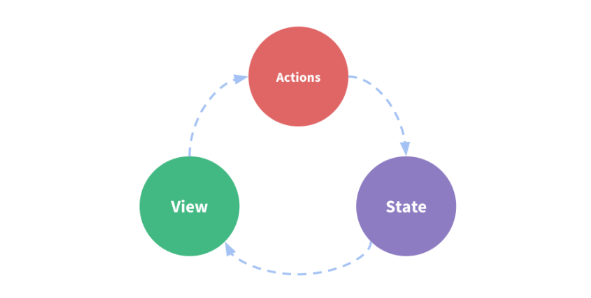

# VUEX

* Vuex is a state management pattern + library for Vue.js applications.
* It implements a **SINGLE STATE TREE** = **CENTRALIZED STORE** = **SINGLE SOURCE OF TRUTH**, which provides an easy way to manage shared state between components, ensuring that the state can only be mutated in a predictable fashion and thus simplifying code and its maintanance and debugging:
  * a single state tree makes it straightforward to locate a specific piece of state, and allows us to easily share state between components
  * state changing in a predictable way allow us to take snapshots of the current app state for debugging purposes

## The Vue problem, the Vuex solution

* Normal Vue apps are a __one-way data flow__:
  * The state, the source of truth that drives our app;
  * The view, a declarative mapping of the state;
  * The actions, the possible ways the state could change in reaction to user inputs from the view.
  * 
* Without vuex you have 
  * events to comunicate state up the hierarchy
  * props to communicate state down the hierarchy
* The simplicity quickly breaks down when we have multiple components that share a common state:
  * Multiple views may depend on the same piece of state.
    * passing props can be tedious for deeply nested components, and simply doesn't work for sibling components
  * Actions from different views may need to mutate the same piece of state (such as in memory shared parallel processes).
    * we often find ourselves resorting to solutions such as reaching for direct parent/child instance references or trying to mutate and synchronize multiple copies of the state via events
* Vuex __extracts the shared state out of the components, and manage it in a global singleton__ thus making our component tree become a big "view", and __any component can access the state or trigger actions, no matter where they are in the tree__
  * __a single state tree__ - that is, this single object contains all your application level state and serves as the __"single source of truth"__
    * This also means usually you will have only one store for each application 
  * This is the basic idea inspired by Flux, Redux and The Elm Architecture.


* When to use it?
  * if your app is simple, you will most likely be fine without Vuex. [A simple store pattern](https://vuejs.org/v2/guide/state-management.html#Simple-State-Management-from-Scratch) may be all you need
  * if you are building a medium-to-large-scale SPA, chances are you have run into situations that make you think about how to better handle state outside of your Vue components, and Vuex will be the natural next step for you.
    * _Flux libraries are like glasses: you’ll know when you need them_

## ASSUMPTIONS: THE RULES OF THE GAME

* Vuex assumptions are:
  1. Application-level state is centralized in the store.
  1. The only way to mutate the state is by committing mutations, which are synchronous transactions.
  1. Asynchronous logic should be encapsulated in, and can be composed with, actions.

# THE STORE

* The store is basically **a container that holds your application state**. There are two things that make a Vuex store different from a plain global object:
  * **Vuex stores are reactive**. When Vue components retrieve state from it, they will reactively and efficiently update if the store's state changes
  * **You cannot directly mutate the store's state. The only way to change a store's state is by explicitly committing mutations**. This ensures every state change leaves a track-able record, and enables tooling that helps us better understand our applications, e.g. log every mutation, take state snapshots, or even perform time travel debugging
  * Using store state in a component simply involves returning the state within a computed property, because the store state is reactive. Triggering changes simply means committing mutations in component methods.

## Store declaration and injection

```js
// ROOT COMPONENT
import Vue from 'vue'
import Vuex from 'vuex'

Vue.use(Vuex) // enables the injecting of the store into child components

// STORE DECLARATION
const store = new Vuex.Store({
  state: {
    count: 0
  },
  mutations: {
    increment (state) {
      state.count++
    }
  }
})

// Store usage in the root component example
store.commit('increment') // change the state commiting a mutation
console.log(store.state.count) // retrieve and use the state

// Declaring the store into a Vue component 
// will inject the store into all it's child components 
// thus making it accessible for them with this.$store
const app = new Vue({
  el: '#app',
  // provide the store using the "store" option.
  // this will inject the store instance to all child components.
  store, // es6 syntax for store: store
  components: { Counter },
  template: `
    <div class="app">
      <counter></counter>
    </div>
  `
})
```

## Storage usage in child components

```js
// CHILD COMPONENTS
// if the store was declared in the app, you can then access the store inside any sub-component with this.$store
const Counter = {
  template: `<div>{{ count }}</div>`,
  // Use a computed property to return the state
  computed: {
    count () {
      return this.$store.state.count
    }
  },
  // commit a mutation to change the store state
  // (it is required, directly changing the store state
  //  should be avoided)
  methods: {
    increment() {
      this.$store.commit('increment')
      console.log(this.$store.state.count)
    }
  }
}
```

### Use mapState to simplify computed properties declaration

```js
// When a component needs to use many store properties declaring all these computed properties can get verbose. Use the the mapState helper instead:

import { mapState } from 'vuex'

export default {
  // ...
  computed: mapState({
    // arrow functions can make the code very succinct!
    count: state => state.count,

    // passing the string value 'count' is same as `state => state.count`
    countAlias: 'count',

    // to access local state with `this`, a normal function must be used
    countPlusLocalState (state) {
      return state.count + this.localCount
    }
  })
}
```

```js
// We can also pass a string array to mapState when the name of a mapped
// computed property is the same as a state sub tree name
computed: mapState([
  // map this.count to store.state.count
  'count'
])
```

```js
// mapState returns an object. If you have other local computed properties other than mapstate's, use the object spread operator to merge the object returned by mapstate and the one containing other computed properties:
computed: {
  localComputed () { /* ... */ },
  // mix this into the outer object with the object spread operator
  ...mapState({
    // ...
  })
}
```

# GETTERS

* Vuex allows us to define "getters" in the store. You can think of them as computed properties for stores. Like computed properties, a getter's result is cached based on its dependencies, and will only re-evaluate when some of its dependencies have changed. (note: this doesn't apply if you return a function, see the example)

```js
// GETTERS DEFINITION INSIDE THE STORE
const store = new Vuex.Store({
  state: {
    todos: [
      { id: 1, text: '...', done: true },
      { id: 2, text: '...', done: false }
    ]
  },
  getters: {
    // Getters will receive the state as their 1st argument
    doneTodos: state => {
      return state.todos.filter(todo => todo.done)
    }
    // ...and can receive other getters as second argument:
    doneTodosCount: (state, getters) => {
      return getters.doneTodos.length
    }
    // ...and you can return a function to add query arguments, though this way the method method will run each time you call it, 
    // and the result is not cached:
    getTodoById: (state) => (id) => {
      return state.todos.find(todo => todo.id === id)
    }
  }
})
```

```js
// USAGE OF GETTERS INSIDE COMPONENTS
store.getters.doneTodos // -> [{ id: 1, text: '...', done: true }]
store.getters.doneTodosCount // -> 1
// inside a sub-component:
computed: {
  doneTodosCount () {
    // you can access getters value as properties
    // (results are cached and managed by Vue's reactivity system)
    return this.$store.getters.doneTodosCount
  },
  getTodoById: (state) => (id) => {
    // getters defined as methods will run each time you call them, 
    // and the result is not cached:
    return state.todos.find(todo => todo.id === id)
  }
}
```

```js
store.getters.getTodoById(2) // -> { id: 2, text: '...', done: false }
```

## Use mapGetters to simplify mapping store getters to a component computed properties

```js
import { mapGetters } from 'vuex'

export default {
  // ...
  computed: {
    // mix the getters into computed with object spread operator
    ...mapGetters([
      'doneTodosCount',
      'anotherGetter',
      // ...
    ])
  }
}
```

```js
...mapGetters({
  // map `this.doneCount` to `this.$store.getters.doneTodosCount`
  doneCount: 'doneTodosCount'
})
```

# MUTATIONS

* **The only way to actually change state in a Vuex store is by committing a mutation**
* Vuex mutations are **very similar to events: each mutation has a string type and a handler**. 
  * **The handler will receive the state as the first argument** and is where we perform actual state modifications
  * **You cannot directly call the handler**. Think of it more like event registration: when the event is triggered, the handler will be called. So you need to trigger the "event", i.e. **to invoke a mutation handler, you need to `store.commit(type)`**
* **MUTATIONS MUST BE SYNCHRONOUS**: this is for them to be trackable by the devtools and thus more deterministic and debuggable
  * it is impossible to know when an asynch function's callback will be called, so any mutation performed in a callback is essentially un-trackable!
  * when you call two methods both with async callbacks that mutate the state, how do you know when they are called and which callback was called first? 

#

```js
// MUTATIONS DECLARATION IN THE STORE
const store = new Vuex.Store({
  state: {
    count: 1
  },
  mutations: {
    increment (state) { // es6 syntax for increment: function(state) {...}
      // mutate state
      state.count++
    }
  }
})
```

```js
// MUTATIONS COMMIT IN A COMPONENT
store.commit('increment')
```

## Mutations with payload (i.e. additional arguments)

* You can add arguments (e.g. the "payload") to the mutation after the state

```js
// Declaration in the store:
mutations: {
  increment (state, n) {
    state.count += n
  }
}
// Mutation commit in a component:
store.commit('increment', 10)
```

```js
// Declaration in the store:
mutations: {
  increment (state, payload) {
    state.count += payload.amount
  }
}
// Mutation commit in a component:
store.commit('increment', {
  amount: 10
})
```

```js
// Object-style mutation commit:
store.commit({
  type: 'increment',
  amount: 10
})
```

## mapMutations

```js
import { mapMutations } from 'vuex'

export default {
  // ...
  methods: {
    ...mapMutations([
      'increment', // map `this.increment()` to `this.$store.commit('increment')`

      // `mapMutations` also supports payloads:
      'incrementBy' // map `this.incrementBy(amount)` to `this.$store.commit('incrementBy', amount)`
    ]),
    ...mapMutations({
      add: 'increment' // map `this.add()` to `this.$store.commit('increment')`
    })
  }
}
```

## Mutation caveats and best-practices

### Mutations follow Vue's reactivity rules

* Since a Vuex store's state is made reactive by Vue:
  * **when we mutate the state, Vue components observing the state will update automatically**. 
  * mutations are subject to the same reactivity caveats when working with plain Vue:
    * **Prefer initializing your store's initial state with all desired fields upfront**.
    * When adding new properties to an Object, you should either
      * **Use `Vue.set(obj, 'newProp', 123)`, or**
      * **Replace that Object with a fresh one**. For example, using the object spread syntax (opens new window)we can write it like this: `state.obj = { ...state.obj, newProp: 123 }`

### Use a constants' file (code-organization best practice tip)

It is a commonly seen pattern to use constants for mutation types in various Flux implementations. This allows the code to take advantage of tooling like linters, and putting all constants in a single file allows your collaborators to get an at-a-glance view of what mutations are possible in the entire application:

```js
// mutation-types.js
export const SOME_MUTATION = 'SOME_MUTATION'
```

```js
// store.js
import Vuex from 'vuex'
import { SOME_MUTATION } from './mutation-types'

const store = new Vuex.Store({
  state: { ... },
  mutations: {
    // we can use the ES2015 computed property name feature
    // to use a constant as the function name
    [SOME_MUTATION] (state) {
      // mutate state
    }
  }
})
```

# APPLICATION STRUCTURE AND STORE FILE SPLITTING

* As long as you follow the Vuex assumptions it's up to you how to structure your project. Anyway, rules of thumb are: 
  * if your store file gets too big you should start **splitting into separate files**, e.g. `actions.js`, `mutations.js` and `getters.js` into separate files with an `index.js` file importing them
  * For any non-trivial app, you should use **MODULES**
  
Here's an example project structure leveraging both **file splitting** and **modules**: 

```text
├── index.html
├── main.js
├── api
│   └── ... # abstractions for making API requests
├── components
│   ├── App.vue
│   └── ...
└── store
    ├── index.js          # where we assemble modules and export the store
    ├── actions.js        # root actions
    ├── mutations.js      # root mutations
    └── modules
        ├── cart.js       # cart module
        └── products.js   # products module
```

## MODULES

* Following Vuex assumptions, there should be only one store for the whole application
* For complex applications Vuex allows us to divide our store into modules. Each module can contain its own state, mutations, actions, getters, and even nested modules - it's fractal all the way down:

```js
const moduleA = {
  state: () => ({ ... }),
  mutations: { ... },
  actions: { ... },
  getters: { ... }
}

const moduleB = {
  state: () => ({ ... }),
  mutations: { ... },
  actions: { ... }
}

const store = new Vuex.Store({
  modules: {
    a: moduleA,
    b: moduleB
  }
})

store.state.a // -> `moduleA`'s state
store.state.b // -> `moduleB`'s state
```