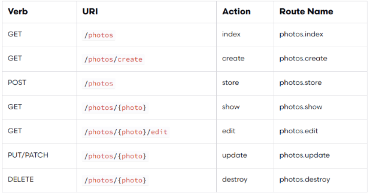

# Forms

# 7 RESTful controller actions

* can be created automatically
  * `php artisan make:model -r` - Model + __Resource controller__
  * `php artisan make:model -a` - all
* Supposing we have a 'Photo' model, its controller will have 7 routes corresponding to 7 actions (below is the naming convention)
  * 
* `php artisan route:list` - list all the routes and associated controllers/actions

# Must do

* `@csrf` - cross site request forgery token control (mandatory!)
* `@method('PUT')` - if the method defined by the laravel route is not POST or GET, you must hint laravel about the method we intend to use in order for it to interpret it correctly (this is necessary as html forms do not support PUT, PATCH, etc)

# Getting the data

* `request()->all()`
* `request('myname')`
* `

# Multiple values

* notice the name of the select is `tags[]`: the square brackets tells laravel that it is an array of values and not a single

```php 
<select name="tags[]">
    @foreach ($tags as $tag)
        <option value="{{$tag->id}}">
            {{$tag->name}}
        </option>
</select>
```