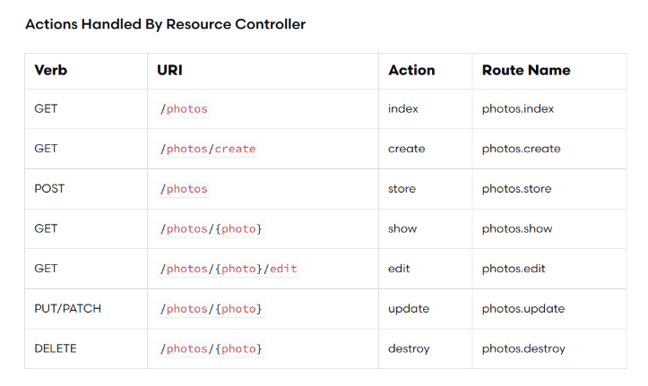

# ROUTING

* route files are located in `routes` directory and are automatically loaded by the framework.
    * `routes/web.php` define web interface routes (with `web` middleware group which provides session state, CSRF, etc).
    * `routes/api.php` are stateless (`api` middleware group, `/api` URI prefix is automatically applied, can be modified in `RouteServiceProvider` class)
* you can define routes resolving using closures or a controller's method and with using parameters (and optionally regex to constrain them)
* you can name a route in order to reference it by name, and you can use groups to apply settings to many routes at once

```php
// Resolve route using closure
Route::get('/', function() {...});

// Resolve route using controller@method
Route::get('/', 'WelcomeController@index'); 

// ...using any of the Http verbs
Route::get($uri, $callback);
Route::post($uri, $callback);
Route::put($uri, $callback);
Route::patch($uri, $callback);
Route::delete($uri, $callback);
Route::options($uri, $callback);
Route::match(['get', 'post'], '/', function () { });
Route::any('/', function () { });
```

## Get route info

```php
// Use the Route facade 
$route = Route::current();
$name = Route::currentRouteName();
$action = Route::currentRouteAction();

// $request->route() in a route middleware 'handle' function
public function handle($request, Closure $next)
{
    if ($request->route()->named('profile')) {
        //
    }
    return $next($request);
}
```

## Redirects

```php
Route::redirect('/here', '/there'); // 302
Route::redirect('/here', '/there', 301); // 301
Route::permanentRedirect('/here', '/there'); // 301
```

## View-only routes

```php
// View only shortcut
Route::view('/welcome', 'welcome');
Route::view('/welcome', 'welcome', ['name' => 'Taylor']);
```

## Fallback route (404)

* Typically, unhandled requests will automatically render a "404" page via your application's exception handler. However, since you may define the fallback route within your routes/web.php file, all middleware in the web middleware group will apply to the route. You are free to add additional middleware to this route as needed:

```php
// in web routes file:
Route::fallback(function () {
    // 404 (should be the last route registered)
});
```

## Routes with parameters

```php
Route::get('posts/{post}/comments/{comment}', function ($postId, $commentId) { // required
    //
});
Route::get('user/{name?}', function ($name = 'John') { // optional
    return $name;
});
```

### Parameters regex

```php
Route::get('user/{id}/{name}', function ($id, $name) {
    //
})->where(['id' => '[0-9]+', 'name' => '[a-z]+']); // regex

Route::get('search/{search}', function ($search) {
    return $search;
})->where('search', '.*'); // allows search parameter to cointain '/'

// ...or in RouteServiceProvider:
public function boot()
{
    Route::pattern('id', '[0-9]+'); // globally and automatically applied
    parent::boot();
}
// ...and then:
Route::get('user/{id}', function ($id) {
    // Only executed if {id} is numeric...
});
```

## Route naming

```php
Route::get('user/{id}/profile', function ($id) { })->name('profile');
Route::get('user/profile', 'UserProfileController@show')->name('profile');
$url = route('profile'); // Generating URLs...
return redirect()->route('profile'); // Generating Redirects...
$url = route('profile', ['id' => 1, 'photos' => 'yes']); // passing parameters
// (Additional parameters will result in a query string: /user/1/profile?photos=yes)
```

## Route grouping (middlewares, namespaces, subdomains, etc)

```php
// Middleware
Route::middleware(['first', 'second'])->group(function () {
    Route::get('/', function () {
        // Uses first & second Middleware
    });

    Route::get('user/profile', function () {
        // Uses first & second Middleware
    });
});

// Namespaces
Route::namespace('Admin')->group(function () {
    // Controllers Within The "App\Http\Controllers\Admin" Namespace
});

// Subdomains
Route::domain('{account}.myapp.com')->group(function () {
    Route::get('user/{id}', function ($account, $id) {
        //
    });
});

// Prefix the URI of each route in the group
Route::prefix('admin')->group(function () {
    Route::get('users', function () {
        // Matches The "/admin/users" URL
    });
});

// Prefix the name of each route in the group
Route::name('admin.')->group(function () {
    Route::get('users', function () {
        // Route assigned name "admin.users"...
    })->name('users');
});
```

## Route - model binding

* If you type-hint the route callback (or the controller constructor/method) by specifying an eloquent model class as parameter, Laravel will try to automatically fetch the model instance with an id equal to the related parameter of the URI. If it can find it, it will inject the instance to the route handler (i.e. the callback or the controller class/method), else it will generate a 404 response.

```php
// default route-model binding
Route::get('api/users/{user}', function (App\User $user) {
    return $user->email;
});

// to use a database column other than id when retrieving a given model class, you may override the getRouteKeyName method on the Eloquent model:
public function getRouteKeyName()
{
    return 'slug';
}

// to customize the resolution logic override the resolveRouteBinding method of your eloquent model:
public function resolveRouteBinding($value)
{
    return $this->where('name', $value)->firstOrFail();
}
```

## Routes caching

* If your application is exclusively using controller based routes (not route closures!), you should take advantage of Laravel's route cache. Using the route cache will drastically decrease the amount of time it takes to register all of your application's routes. In some cases, your route registration may even be up to 100x faster.
* After running `artisan route:cache` command, your cached routes file will be loaded on every request. 
* Remember, if you add any new routes you will need to generate a fresh route cache.

```bash
php artisan route:cache
php artisan route:clear
```

## Routes rate limiting

* Laravel includes a middleware to rate limit access to routes within your application. 
* The `throttle` middleware accepts two parameters that determine the maximum number of requests that can be made in a given number of minutes. 

```php
// An authenticated user may access the route 60 times per minute
Route::middleware('auth:api', 'throttle:60,1')->group(function () {
    Route::get('/user', function () {
        // 
    });
});

// An authenticated user may access the route rate_limit times per minute,
// where rate_limit is a User model's attribute
Route::middleware('auth:api', 'throttle:rate_limit,1')->group(function () {
    Route::get('/user', function () {
        //
    });
});

// 10 requests per minute for guests and 60 for authenticated users:
Route::middleware('throttle:10|60,1')->group(function () {
    //
});
// 10 requests for guests and rate_limit for authenticated users:
// where rate_limit is a User model's attribute
Route::middleware('auth:api', 'throttle:10|rate_limit,1')->group(function () {
    Route::get('/user', function () {
        //
    });
});

// Different rate limits for different segments of the API:
Route::middleware('auth:api')->group(function () {
    Route::middleware('throttle:60,1,default')->group(function () {
        Route::get('/servers', function () {
            //
        });
    });
    Route::middleware('throttle:60,1,deletes')->group(function () {
        Route::delete('/servers/{id}', function () {
            //
        });
    });
});
```

# MIDDLEWARE

* you can envision middleware as a series of "layers" HTTP requests must pass through before they hit your application. Each layer can examine the request and even reject it entirely.
* middleware classes are in `app/Http/Middleware` directory and Laravel provides several ones by default (e.g. `web`, `api`, `auth`, etc). 

## Create a middleware

* `artisan make:middleware CheckAge` will create a middleware class with scaffold code: in `handle` function you can use `$request` object and `$next` closure (which refers to the subsequent layers of the http request).

```bash
artisan make:middleware CheckAge
```

```php
namespace App\Http\Middleware;
use Closure;

class CheckAge
{
    public function handle($request, Closure $next)
    {
        if ($request->age <= 200) {
            return redirect('home');
        }
        return $next($request);
    }
}
```

## Register and apply middlewares

* `app/Http/Kernel.php` is the default class for middleware setup: you can register your middleware classes (e.g. `\App\Http\Middleware\CheckAge::class`) here. 
    * adding it to the `$middleware` array will make the middleware applied to all http requests
    * adding a `'name' => \App\Http\Middleware\CheckAge::class` in the `$routeMiddleware` associative array will register a named middleware which you can apply in route definitions or in controller classes (or methods)
    * adding a `'name' => [ \App\Http\Middleware\MyMiddleware1::class, ... ]` in the `$middlewareGroups` will register a named group of middlewares which you can apply all at once in route definitions or in controller classes (or methods)
    * you can assing an order to the non-global middlewares in the `$middlewarePriority` array

```php
// Register a middleware in a route:
Route::get('profile', 'UserController@show')->middleware('auth');
Route::get('/', function () {
    //
})->middleware('first', 'second'); 
Route::get('admin/profile', function () {
    //
})->middleware(CheckAge::class); // you may also pass the fully qualified class name
Route::get('/', function () {
    //
})->middleware('web'); // web refers a group of middleware
// assign the middlewares to a group of routes
Route::group(['middleware' => ['web']], function () { });
Route::middleware(['web', 'subscribed'])->group(function () { }); 

// Register a middleware in a controller (constructor or method):
class UserController extends Controller
{
    public function __construct()
    {
        $this->middleware('auth');
        $this->middleware('log')->only('index');
        $this->middleware('subscribed')->except('store');
        $this->middleware(function ($request, $next) {
            // ...
            return $next($request);
        });
    }
}
```

## Middleware parameters

* you can add middleware parameters by adding additional arguments to the `handle` function, after the `$next` argument, and then you can pass those parameter during the middleware registration in a route:

```php
// you can assign additional parameters after $next
class CheckRole
{
    public function handle($request, Closure $next, $role) 
    {
        if (! $request->user()->hasRole($role)) {
            // Redirect...
        }
        return $next($request);
    }
}

// ...then you can pass parameters during middleware registration with 'name:par1:par2:...' syntax
Route::put('post/{id}', function ($id) {
    //
})->middleware('role:editor');
```

## Add additional tasks after middleware (before response is sent to the browser)

* the `terminate` method of the middleware class allows you to perform additional tasks after the response is sent to the browser

```php
class StartSession
{
    public function handle($request, Closure $next)
    {
        return $next($request);
    }

    public function terminate($request, $response)
    {
        // Store the session data...
    }
}
```

# CONTROLLERS

* Controllers incapsulates request handling logic 
* Controllers are located in `app/Http/Controllers` 
* The Controller base class provides useful methods such as `middleware`, `validate`, `dispatch`, etc

## Create a Controller

```bash
artisan make:controller UserController
```

```php
namespace App\Http\Controllers;
use App\Http\Controllers\Controller;
use App\User;

class UserController extends Controller
{
    public function __construct()
    {
        // you can assign middlewares in the constructor:
        $this->middleware('auth');
        $this->middleware('log')->only('index');
        $this->middleware('subscribed')->except('store');
        $this->middleware(function ($request, $next) {
        // you can use a closure, without defining an entire middleware class
        return $next($request);
        });
    }

    public function show($id)
    {
        return view('user.profile', ['user' => User::findOrFail($id)]);
    }
}

// Associate a route with a controller:
Route::get('user/{id}', 'UserController@show'); // route parameter id will be passed to the controller
// If you choose to nest your controllers deeper into the App\Http\Controllers directory,
//  use the specific class name relative to the App\Http\Controllers root namespace.
Route::get('foo', 'Photos\AdminController@method'); // App\Http\Controllers\Photos\AdminController
```

## Single action controllers

```bash
php artisan make:controller ShowProfile --invokable
```

```php
class ShowProfile extends Controller
{
    public function __invoke($id)
    {
        return view('user.profile', ['user' => User::findOrFail($id)]);
    }
}

// Route association without method:
Route::get('user/{id}', 'ShowProfile');
```

## Controllers dependency injection

* if you type-hint a controller constructor or method providing typed arguments that the Service Container is able to resolve, they will be automatically injected in the controller (or method). You may also type-hint any Laravel contract. If the container can resolve it, you can type-hint it.

```php
class UserController extends Controller
{
    protected $users;

    public function __construct(UserRepository $users) // users injection
    {
        $this->users = $users;
    }

    public function update(Request $request) // request injection, id extracted from route
    {
        $name = $request->name;
        //
    }
}

// users will be automatically injected in the constructor, id will be extracted from the URI and passed to the method
// request will be automatically injected into the update method
// id will be extracted from the URI and passed to the update method
Route::put('user/{id}', 'UserController@update'); 
```

## Resource Controllers 

* Laravel provides a handy 'Resource' code scaffolding for REST-API CRUD operations:
* [See docs](https://laravel.com/docs/6.x/controllers#resource-controllers) for more.



```bash
# will generate a controller with all CRUD methods stubbed,
php artisan make:controller PhotoController --resource

# type hints a given model to each of these methods
# (e.g. if you are using route model binding)
php artisan make:controller PhotoController --resource --model=Photo

# Will exclude 'create' and 'edit' (which is common for apis)
php artisan make:controller API/PhotoController --api
```

```php
// creates multiple routes to handle actions on the resource 
// (which correspond to the generated controller method stubs)
Route::resource('photos', 'PhotoController');
Route::resources([
    'photos' => 'PhotoController',
    'posts' => 'PostController'
]);

// you can specify a subset of actions:
Route::resource('photos', 'PhotoController')->only([
    'index', 'show'
]);
Route::resource('photos', 'PhotoController')->except([
    'create', 'store', 'update', 'destroy'
]);

// Will exclude 'create' and 'edit' (which is common for apis)
Route::apiResource('photos', 'PhotoController');
Route::apiResources([
    'photos' => 'PhotoController',
    'posts' => 'PostController'
]);
```

# REQUESTS 

* To obtain an instance of the current HTTP request via dependency injection, you should type-hint the `Illuminate\Http\Request` class on your controller method. The incoming request instance will automatically be injected by the service container. Then you can use all of its provided methods.

```php
Route::put('user/{id}', 'UserController@update');

namespace App\Http\Controllers;
use Illuminate\Http\Request;

class UserController extends Controller
{
    // inject the Request in the controller's method
    public function update(Request $request, $id)
    {
        // path
        $uri = $request->path();
        if ($request->is('admin/*')) { }
        $url = $request->url(); // Without Query String
        $url = $request->fullUrl(); // With Query String
        
        // method
        $method = $request->method();
        if ($request->isMethod('post')) { }

        // inputs
        $input = $request->all(); // all input data as array
        $name = $request->input('name'); // specific input
        $name = $request->input('name', 'Sally'); // specific input with default value
        $name = $request->input('products.0.name'); // access input from forms that contain arrays
        $names = $request->input('products.*.name');
        $input = $request->input(); // all input values as associative array
        $name = $request->query('name'); // input from the query string only
        $name = $request->query('name', 'Helen');
        $query = $request->query(); // all query string input as associative array

        // you can also use dynamic properties: will look the payload first and then the route parameters
        $name = $request->name;

        // you can dig into json input (as long as the header type is application/json)
        $name = $request->input('user.name');

        // boolean returns true for 1, "1", true, "true", "on", and "yes"
        $archived = $request->boolean('archived'); 

        // retrieve only a subset of the input
        $input = $request->only(['username', 'password']);
        $input = $request->only('username', 'password');
        $input = $request->except(['credit_card']);
        $input = $request->except('credit_card');

        // value presence 
        if ($request->has('name')) { }
        if ($request->has(['name', 'email'])) { }
        if ($request->hasAny(['name', 'email'])) { }
        if ($request->filled('name')) { } // present and not empty
        if ($request->missing('name')) { } // check if absent
    }
}

// ...or inject the request in the route closure:
public function update(Request $request, $id)
{
    //
}
```

## Old request input (e.g. for former form's input)

* Laravel allows you to keep input from one request during the next request. This feature is particularly useful for re-populating forms after detecting validation errors. However, if you are using Laravel's included validation features, it is unlikely you will need to manually use these methods

```php
// flash the current input to the session so that it is available during the user's next request to the application:
$request->flash();
$request->flashOnly(['username', 'email']);
$request->flashExcept('password');

// you can chain input flashing with a redirect
return redirect('form')->withInput();
return redirect('form')->withInput(
    $request->except('password')
);

// then you can access old input with
$username = $request->old('username');
```
```html
<!-- or with the global helper 'old', e.g. in a blade template -->
<input type="text" name="username" value="{{ old('username') }}">
```

## Cookies

* All cookies created by the Laravel framework are encrypted and signed with an authentication code, meaning they will be considered invalid if they have been changed by the client.  

```php
// Retrieve a cookie from the request
$value = $request->cookie('name');

// ...or using the facade
use Illuminate\Support\Facades\Cookie;
$value = Cookie::get('name'); 

// Create a cookie (needs to be attached to a response)
$cookie = cookie('name', 'value', $minutes);
return response('Hello World')->cookie($cookie);

// Attach a cookie to the response
return response('Hello World')->cookie(
    'name', 'value', $minutes
);
return response('Hello World')->cookie(
    'name', 'value', $minutes, $path, $domain, $secure, $httpOnly
);

// "queue" cookies for attachment to the outgoing response
Cookie::queue(Cookie::make('name', 'value', $minutes));
Cookie::queue('name', 'value', $minutes);
```

## Files

* For more methods, [see api docs](https://api.symfony.com/3.0/Symfony/Component/HttpFoundation/File/UploadedFile.html)

```php
$file = $request->file('photo');
$file = $request->photo;
if ($request->hasFile('photo')) { }
if ($request->file('photo')->isValid()) { }
$path = $request->photo->path();
$extension = $request->photo->extension();
```

### Storing uploaded files

* To store an uploaded file, you will typically use one of your configured filesystems. The UploadedFile class has a store method which will move an uploaded file to one of your disks, which may be a location on your local filesystem or even a cloud storage location like Amazon S3.
* The store method accepts the path where the file should be stored relative to the filesystem's configured root directory. This path should not contain a file name, since a unique ID will automatically be generated to serve as the file name.
* The store method also accepts an optional second argument for the name of the disk that should be used to store the file. The method will return the path of the file relative to the disk's root:

```php
$path = $request->photo->store('images');
$path = $request->photo->store('images', 's3');
$path = $request->photo->storeAs('images', 'filename.jpg');
$path = $request->photo->storeAs('images', 'filename.jpg', 's3');
```

### Configuring trusted proxies

* When running your applications behind a load balancer that terminates TLS / SSL certificates, you may notice your application sometimes does not generate HTTPS links. Typically this is because your application is being forwarded traffic from your load balancer on port 80 and does not know it should generate secure links.
* [see docs](https://laravel.com/docs/6.x/requests#configuring-trusted-proxies) for more info


