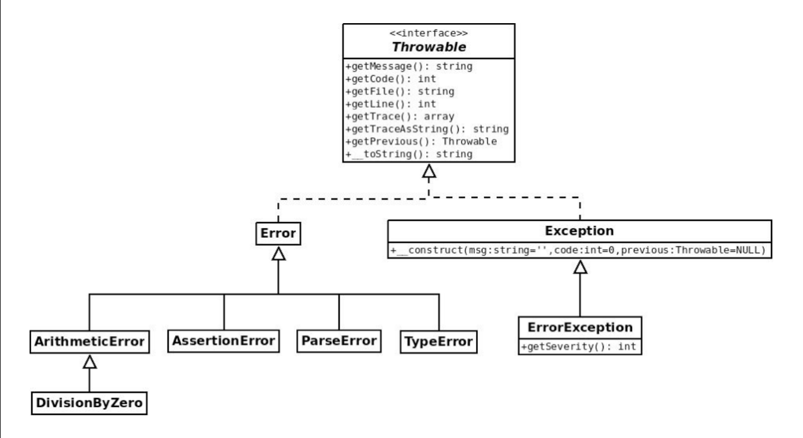

Error handling and logging
==========================

* Three types: 1) Errors (blocking, severe), Warning(non-blocking, medium severity), Notice(non-blocking, non-severe).
* [Predefined constants for errors](https://www.php.net/manual/en/errorfunc.constants.php)
  * every error has an integer value, in ascending severity
  * `error_reporting([int $level])` - set the error reporting severity level (error with a value lower than `$level` won't be reported). Won't affect parsing errors, cause they're intercepted before execution.
* `ini_set("display_errors", false)` - disable error displaying (for production code). 
  * Errors will be still sent to stderr, so they'll be visible in cli. To redirect them to a log file use `error_log` 
  * Web servers automatically manage this, e.g. Apache redirects stderr to `/var/log/Apache2/error.log`
* `ini_set("error_log", "data/log/error.log");` - set an error log file (this is application-wide, whereas changing `php.ini` directly would be system-wide)
* `error_log (string $message [, int $message_type = 0 [, string $destination [, string $extra_headers ]]])` - directly writes a message in the log file with various options (e.g. send error via email, write it in a file, send it to the server SAPI interface, etc). [See more](https://www.php.net/manual/en/function.error-log.php) 
  * When writing to a log file, you should beware `'`, `"`, `\` and `\0`. E.g. the null character `\0` will truncate the message (c-like)! We can either escape them all manually with '\`, or we can use `base64_encode()`, or `rawurlencode()`
* `trigger_error` or `user_error` - manually triggers an error with 
* `set_error_handler` - sets a custom function as the default error-handling function (integrating or substituting the default php error handling
  * `restore_error_handler` - restores the previous one

```php
// Turn off all error reporting
error_reporting(0);
// Report simple running errors
error_reporting(E_ERROR | E_WARNING | E_PARSE);
// Report all errors except E_NOTICE
error_reporting(E_ALL & ~E_NOTICE);
// Report all PHP errors (see changelog)
error_reporting(E_ALL); // equals to error_reporting(-1)
// Report all PHP errors but do not display them
error_reporting(E_ALL);
ini_set("display_errors", false); 
// redirect errors to stderr: the web server won't show them
// (but they're still visible in cli mode)
```

Exceptions handling
===================

Try-catch-finally
-----------------

* `try {...} catch(Exception $e) {...} finally {...}` - java-like

```php
// multiple catches, multiple exception types
try {
  // ...
} catch (Exception1 | Exception2 $e) {
  // ...
} catch (Exception $e) {
  // ...
} finally {
  // ...
}
```

Throwable hierarchy
-------------------



* the above hierarchy is php7. php5 hierarchy was different so there may be compatibility issues (e.g. to be compatible with php5 you should change `Throwable`(php7) to `Exception`(php5) or remove the exception typing, thus being less specific and more compatible)
* Exceptions are related to the user, whereas Errors are related to the code.
* all exceptions and errors are throwable, so they all have: `getMessage`, `getCode`, `getFile`, `getLine`, `getTrace`, `getTraceAsString`, `getPrevious`, etc [See throwable](https://www.php.net/manual/en/class.throwable.php)

```php
// You can use exception hierarchy to verify class of errors, e.g.
// verivy parsing errors
try {
    require 'foo.php';
} catch (\ParseError $e) {
    printf("Parse error: %s\n", $e->getMessage());
}
// verify not existing functions
try {
    non_exist_function();
} catch (\Error $e) {
    printf("Error: %s\n", $e->getMessage());
}
// ...etc
```
 
